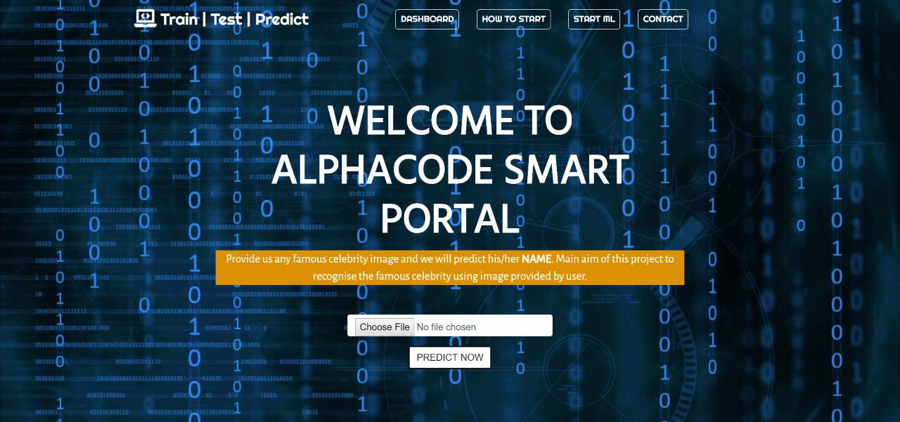

# ALPHACODE

This project detects facial coordinates in given user image and identifies the person identity.
The model classifier itself with various celebs and finds the accurate result.
The model is user based web app that allows user to upload an image and identify the person in a crowd where the person is.
User gets the output with less effort and no technical skills required.
Framework Used: DJANGO

Download [training.yml](https://drive.google.com/open?id=1kMgv4Nja3nld9SOeFKDvj-1km0GzQ2Eb) file and paste it inside celebclassifier/mainclassifier/
